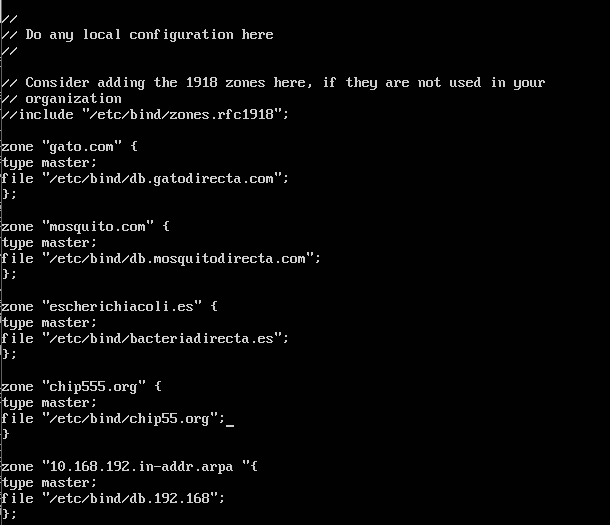

# EJERCICIO APACHE

## CONFIGURACIÓN APACHE
~~~
Crear un servidor Apache con 4 virtual host:   
- www.gato.com -> mostrarÁ la imagen de un gato.     
- www.mosquito.com -> mostrará la imagen de un mosquito tigre.   
- www.escherichiacoli.es -> mostrará la imagen de la bacteria escherichiacoli. Sólo tendrá acceso el usuario 'user01'.   
- www.chip555.org -> mostrará la imagen del chip 555. Sólo tendrán acceso los usuarios del fichero de password creado.    

Crear una máquina con el servidor Apache y el servidor dns necesario.
Crear otra máquina con un entorno gráfico para comprobar el correcto funcionamiento.
~~~

**UNA VEZ INSTALADO EL SISTEMA, INSTALAREMOS APACHE2**
~~~
sudo apt-get install apache2
~~~

### CREACIÓN DE HOST VIRTUALES

El primer paso será crear una estructura de directorios que alojará los datos del sitio que vamos a proporcionar a nuestros visitantes.
~~~
sudo mkdir -p /var/www/gato.com/html
sudo mkdir -p /var/www/mosquito.com/html
sudo mkdir -p /var/www/escherichiacoli.es/html
sudo mkdir -p /var/www/chip555.org/html
~~~

Damos permisos.
~~~
sudo chmod -R 777 /var/www
~~~

Creamos los sitios web(Cuando comprobemos que funcione, editaremos el fichero creado).
~~~
echo "gato.com" > /var/www/gato.com/html/index.html
echo "mosquito.com" > /var/www/mosquito.com/html/index.html
echo "escherichiacoli.es" > /var/www/escherichiacoli.es/html/index.html
echo "chip555.org" > /var/www/chip555.org/html/index.html
~~~

Los archivos virtual host son archivos que especifican la configuración actual de un virtual host e indican como el servidor Apache va a responder a varias solicitudes de dominio.
Apache viene con un archivo virtual host por defecto llamado 000-default.conf. Vamos a copiarlo para crear un archivo virtual host para cada uno de nuestros dominios.
~~~
sudo cp /etc/apache2/sites-available/000-default.conf /etc/apache2/sites-available/gato.com.conf
sudo cp /etc/apache2/sites-available/000-default.conf /etc/apache2/sites-available/mosquito.com.conf
sudo cp /etc/apache2/sites-available/000-default.conf /etc/apache2/sites-available/escherichiacoli.es.conf
sudo cp /etc/apache2/sites-available/000-default.conf /etc/apache2/sites-available/chip555.org.conf
~~~

Configuramos los ficheros.
~~~
www.gato.com
~~~

~~~
www.mosquito.com
~~~

~~~
www.escherichiacoli.es
~~~

~~~
www.chip555.org
~~~

Ahora que hemos creado nuestros archivos de virtual host, debemos habilitarlos. Apache incluye algunas herramientas que nos permiten hacer esto.

Podemos usar la herramienta a2ensite para habilitar cada uno de nuestros sitios.

~~~
sudo a2ensite gato.com.conf
sudo a2ensite mosquito.com.conf
sudo a2ensite escherichiacoli.es.conf
sudo a2ensite chip555.org.conf
~~~

Deshabilitamos el sitio por defecto definido en 000-default.conf:
~~~
sudo a2dissite 000-default.conf
~~~

Reiniciamos el demonio.
~~~
sudo service apache2 restart
~~~

### Autentificación, Autorización y Control de Acceso
El ejercicio nos pide que pueda acceder a la web www.escherichiacoli.es solamente el user01, y a la web www.chip555.org los usuarios
del fichero password creado. Para ello, necesitaremos crear un archivo de contraseñas. Éste archivo debería colocarlo en algún sitio no accesible mediante la Web. Para crear un archivo de contraseñas, usaremos la utilidad htpasswd que viene con Apache. Para crear el archivo:
~~~
sudo htpasswd -c /var/www/escherichiaoli.es/passwords user01
sudo htpasswd -c /var/www/chip555.org/passwords user02
sudo htpasswd -c /var/www/chip555.org/passwords user02
~~~

Ahora tendremos que añadir a nuestros ficheros de configuración lo siguiente:
~~~
www.escherichiacoli.es
~~~

~~~
www.chip555.org
~~~

## CONFIGURACIÓN DNS
**INSTALAREMOS BIND9**
~~~
sudo apt-get install bind9
~~~

**NOS IREMOS A CONFIGURAR LOS ARCHIVOS DE BIND, A LA RUTA /etc/bind.
AQUÍ DEBEREMOS MODIFICAR EL FICHERO DE DECLARACIÓN DE ZONAS: named.conf.local**

**DESPUES CONFIGURAREMOS LAS ZONAS DIRECTAS E INVERSAS**
~~~
gato.com
~~~

~~~
mosquito.com
~~~

~~~
escherichiacoli.es
~~~

~~~
chip555.org
~~~

**REINICIAMOS EL DEMONIO DE BIND**
~~~
/etc/init.d/bind9 restart
~~~

**Y POSTERIORMENTE COMPROBAMOS SI HACE BIEN LA RELACIÓN DE NOMBRES DE DOMINIO**
~~~
host www.gato.com
~~~

## ENTORNO GRÁFICO

Ahora procederemos a introducir en nuestro navegador las direcciones que hemos configurado en el Servidor DNS y APACHE:

