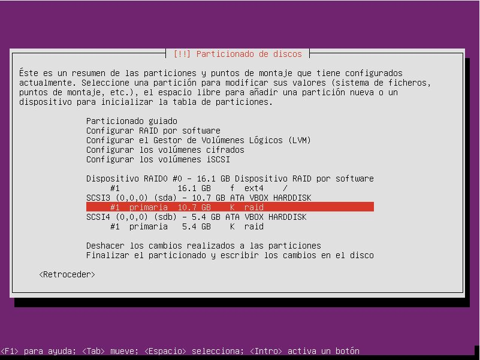
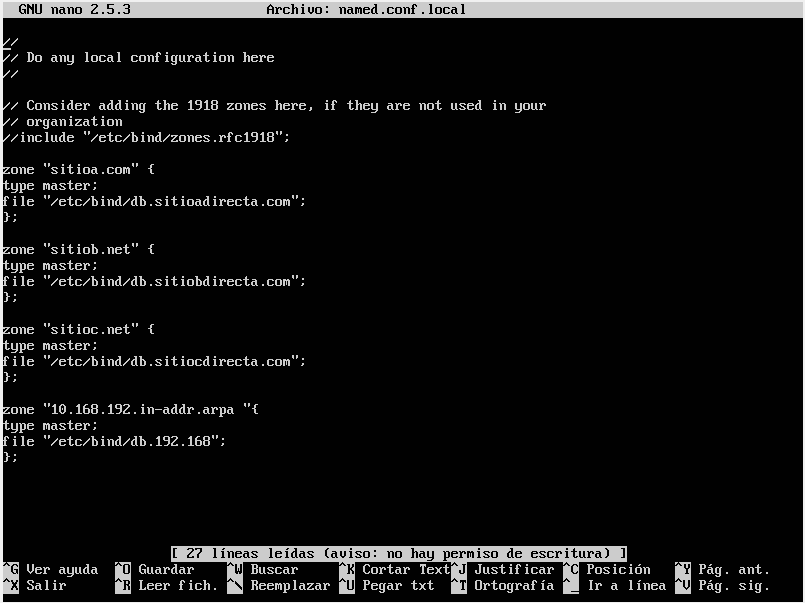
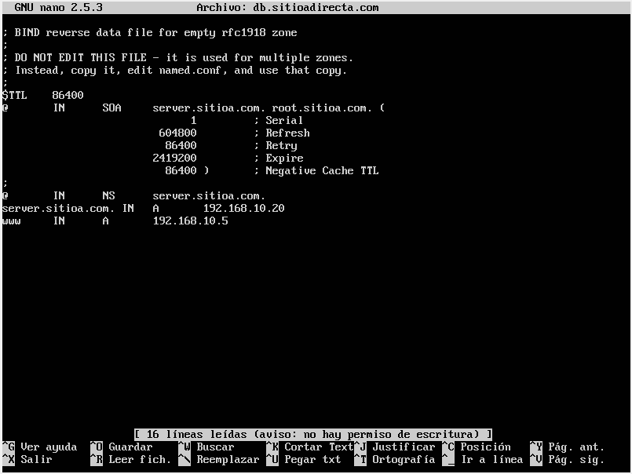
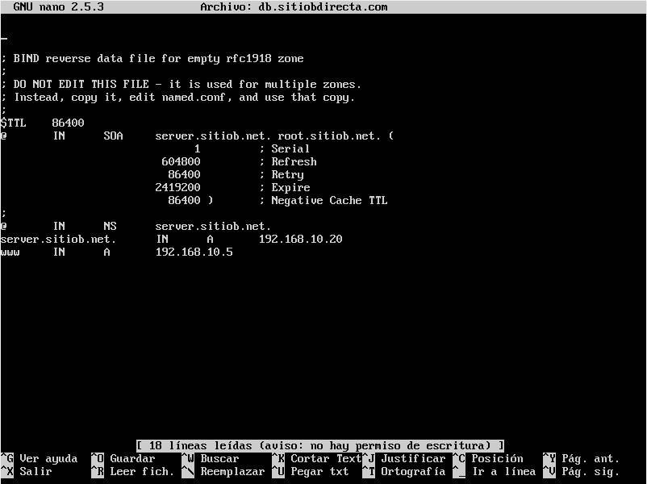
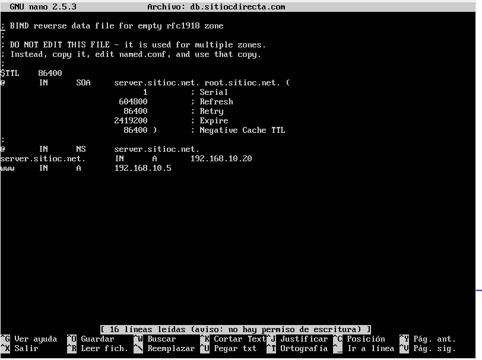

#EJERCICIO DNS

~~~
Crear un servidor DNS con las siguientes zonas:  
- sitioa.com  
    - www web con información de java.  
    - ftp servidor ftp.  
- sitiob.net
    - www web con información de C#  
- sitioc.net.
    - www web con información de Oracle.  
    

Crear una máquina virtual con un entorno gráfico. Esta accederá a los sitios web.  
El servidor DNS será RAID 0.  
Los Servidores web ftp serán RAID 5.
~~~

**EL SERVIDOR DNS TIENE QUE SER RAID 0:**

**UNA VEZ INSTALADO EL SISTEMA, INSTALAREMOS BIND9**
~~~
sudo apt-get install bind9
~~~

**NOS IREMOS A CONFIGURAR LOS ARCHIVOS DE BIND, A LA RUTA /etc/bind.
AQUÍ DEBEREMOS MODIFICAR EL FICHERO DE DECLARACIÓN DE ZONAS: named.conf.local**

**DESPUES CONFIGURAREMOS LAS ZONAS DIRECTAS E INVERSAS**
~~~
sitioa.com
~~~

~~~
sitiob.net
~~~

~~~
sitioc.net
~~~

**REINICIAMOS EL DEMONIO DE BIND**
~~~
/etc/init.d/bind9 restart
~~~

**Y POSTERIORMENTE COMPROBAMOS SI HACE BIEN LA RELACIÓN DE NOMBRES DE DOMINIO**
~~~
host www.sitioa.com
~~~
