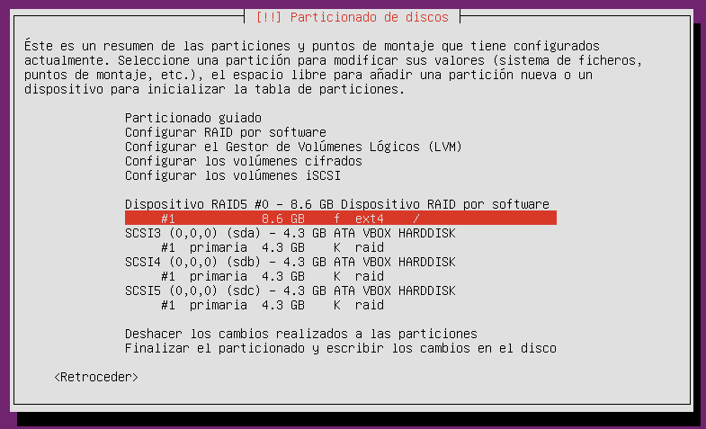
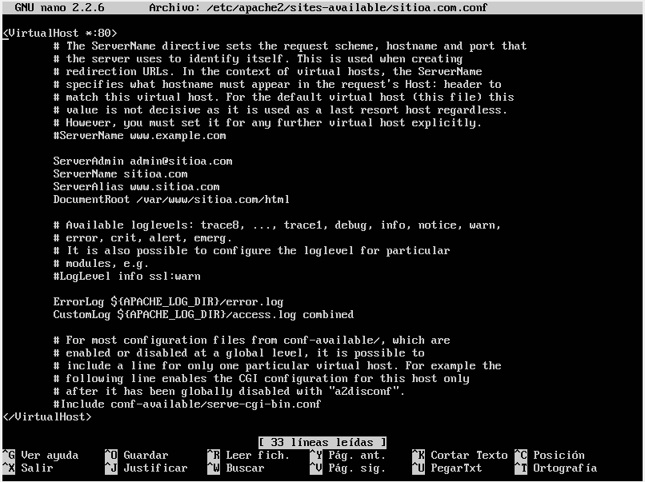
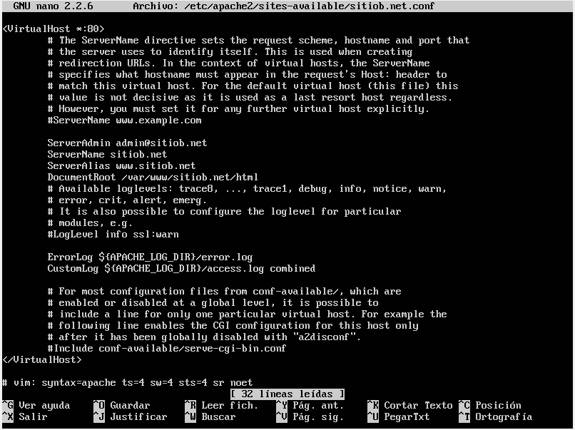

# EJERCICIO DNS

## CONFIGURACIÓN DNS
~~~
Crear un servidor DNS con las siguientes zonas:  
- sitioa.com  
    - www web con información de java.  
    - ftp servidor ftp.  
- sitiob.net
    - www web con información de C#  
- sitioc.net.
    - www web con información de Oracle.  
    

Crear una máquina virtual con un entorno gráfico. Esta accederá a los sitios web.  
El servidor DNS será RAID 0.  
Los Servidores web ftp serán RAID 5.
~~~

**EL SERVIDOR DNS TIENE QUE SER RAID 0:**

**UNA VEZ INSTALADO EL SISTEMA, INSTALAREMOS BIND9**
~~~
sudo apt-get install bind9
~~~

**NOS IREMOS A CONFIGURAR LOS ARCHIVOS DE BIND, A LA RUTA /etc/bind.
AQUÍ DEBEREMOS MODIFICAR EL FICHERO DE DECLARACIÓN DE ZONAS: named.conf.local**

**DESPUES CONFIGURAREMOS LAS ZONAS DIRECTAS E INVERSAS**
~~~
sitioa.com
~~~

~~~
sitiob.net
~~~

~~~
sitioc.net
~~~

**REINICIAMOS EL DEMONIO DE BIND**
~~~
/etc/init.d/bind9 restart
~~~

**Y POSTERIORMENTE COMPROBAMOS SI HACE BIEN LA RELACIÓN DE NOMBRES DE DOMINIO**
~~~
host www.sitioa.com
~~~

## CONFIGURACIÓN APACHE Y FTP

**EL SERVIDOR WEB TIENE QUE SER RAID 5:**

**UNA VEZ INSTALADO EL SISTEMA, INSTALAREMOS APACHE2**
~~~
sudo apt-get install apache2
~~~

### CREACIÓN DE HOST VIRTUALES

El primer paso será crear una estructura de directorios que alojará los datos del sitio que vamos a proporcionar a nuestros visitantes.
~~~
sudo mkdir -p /var/www/sitioa.com/html
sudo mkdir -p /var/www/sitiob.net/html
sudo mkdir -p /var/www/sitioc.net/html
~~~

Damos permisos.
~~~
sudo chmod -R 777 /var/www
~~~
Creamos cutremente el sitio web.
~~~
echo "INFORMACIÓN DE JAVA" > /var/www/sitioa.com/html/index.html
echo "INFORMACIÓN DE C#" > /var/www/sitiob.net/html/index.html
echo "INFORMACIÓN DE ORACLE" > /var/www/sitioc.net/html/index.html
~~~

Los archivos virtual host son archivos que especifican la configuración actual de un virtual host e indican como el servidor Apache va a responder a varias solicitudes de dominio.
Apache viene con un archivo virtual host por defecto llamado 000-default.conf. Vamos a copiarlo para crear un archivo virtual host para cada uno de nuestros dominios.
~~~
sudo cp /etc/apache2/sites-available/000-default.conf /etc/apache2/sites-available/sitioa.com.conf
sudo cp /etc/apache2/sites-available/000-default.conf /etc/apache2/sites-available/sitiob.net.conf
sudo cp /etc/apache2/sites-available/000-default.conf /etc/apache2/sites-available/sitioc.net.conf
~~~

Configuramos los ficheros.

 

Ahora que hemos creado nuestros archivos de virtual host, debemos habilitarlos. Apache incluye algunas herramientas que nos permiten hacer esto.

Podemos usar la herramienta a2ensite para habilitar cada uno de nuestros sitios.

~~~
sudo a2ensite sitioa.com.conf
sudo a2ensite sitiob.net.conf
sudo a2ensite sitioc.net.conf
~~~

Deshabilitamos el sitio por defecto definido en 000-default.conf:
~~~
sudo a2dissite 000-default.conf
~~~

Reiniciamos el demonio.
~~~
sudo service apache2 restart
~~~
